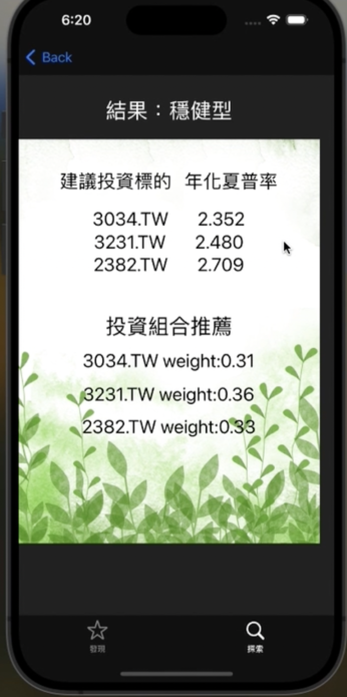

# Stock-Market-Price-Prediction-App
This app provides user the history stock price of each stock and the predicted future stock prices. Additionally, we have made a questionaire for users in the app. After completing the questionaire, we would recommend user a customized investment portfolios based on his investment habits.

## App Function Introduction
### Home Page
 

### Stock Price and Predicted Price
 

### Questionaire
 

### Investment Portfolios
 

## Demo Video
https://drive.google.com/file/d/1bxUb79VNQB1vkgSgqq5QbThCV8sELbB-/view?usp=sharing
